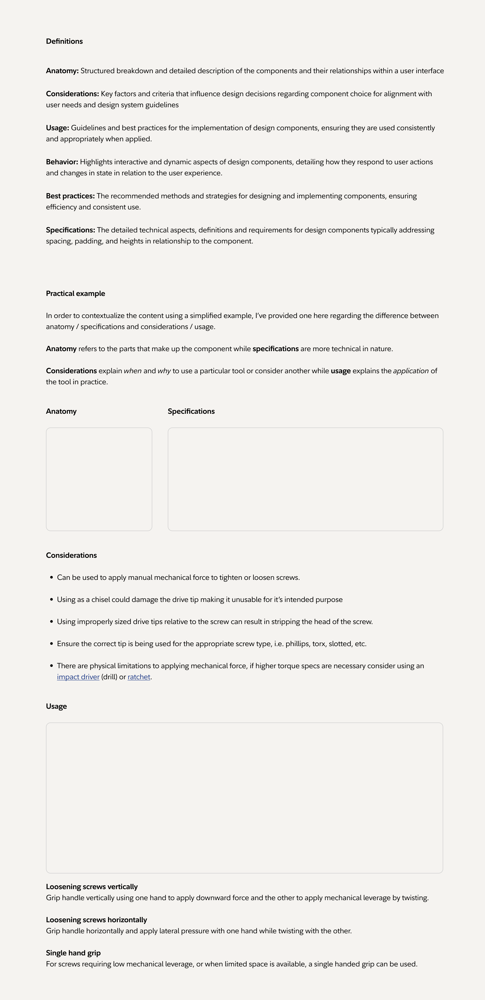

# Enterprise Documentation System Technical Architecture

This document provides a detailed overview of the technical architecture of the Enterprise Documentation System (EDS). It outlines the system design, data flow, and component relationships to help developers understand the overall structure.

## System Overview

The Enterprise Documentation System is a static site built with Eleventy (11ty) that consolidates documentation from multiple legacy sources into a unified platform. The architecture follows these key principles:

1. **Static Site Generation**: Content is pre-rendered at build time
2. **Component-Based Structure**: UI is built from reusable components
3. **Content-as-Data**: Content is treated as structured data
4. **Progressive Enhancement**: Core functionality works without JavaScript
5. **Separation of Concerns**: Clear separation between content, presentation, and behavior

## High-Level Architecture



The system consists of these major subsystems:

1. **Content Subsystem**: Manages documentation content in Markdown and other formats
2. **Templating Subsystem**: Renders content using Nunjucks templates
3. **Migration Subsystem**: Converts legacy content to the EDS format
4. **Styling Subsystem**: Manages appearance using Tailwind CSS
5. **Interaction Subsystem**: Provides client-side interactivity with Alpine.js
6. **Build Subsystem**: Transforms source files into static output

## Detailed Component Architecture

### Content Subsystem

The content subsystem manages documentation in various formats:

```
src/
├── components/          # Component documentation
├── design-tokens/       # Design system tokens
├── patterns/            # Design patterns
├── guidelines/          # Usage guidelines
└── migrated/            # Migrated content
```

#### Content Formats

- **Markdown (.md)**: Primary content format with front matter
- **Nunjucks (.njk)**: Template-based content with dynamic rendering
- **HTML**: Used for complex, highly structured content

#### Front Matter Schema

```yaml
---
title: Page Title
description: Page description
layout: layouts/component.njk
eleventyNavigation:
  key: UniqueKey
  parent: ParentKey
  order: 100
status: stable|beta|experimental|deprecated
tags:
  - tag1
  - tag2
lastUpdated: 2023-01-01
---
```

### Templating Subsystem

The templating subsystem uses Nunjucks for content rendering:

```
src/_includes/
├── layouts/             # Page layouts
│   ├── base.njk         # Base layout
│   ├── component.njk    # Component documentation layout
│   └── ...              # Other specialized layouts
└── components/          # Reusable UI components
    ├── navigation/      # Navigation components
    ├── layout/          # Layout components
    └── feedback/        # Feedback components
```

#### Layout Inheritance

```
┌─────────────────┐
│    base.njk     │
└────────┬────────┘
         │
    ┌────┴─────┐
    │          │
┌───▼───┐  ┌───▼───┐
│ page  │  │ comp  │
│ .njk  │  │ .njk  │
└───────┘  └───┬───┘
               │
          ┌────┴─────┐
          │          │
      ┌───▼───┐  ┌───▼───┐
      │ api   │  │pattern│
      │ .njk  │  │ .njk  │
      └───────┘  └───────┘
```

### Data Flow Architecture

The system uses a structured data flow for content rendering:

```
┌──────────────┐    ┌──────────────┐    ┌──────────────┐
│  Content &   │    │   Eleventy   │    │  Templates   │
│ Front Matter ├───►│ Collections  ├───►│    (Njk)     │
└──────────────┘    └──────────────┘    └──────┬───────┘
       ▲                   ▲                   │
       │                   │                   ▼
┌──────┴───────┐    ┌──────┴───────┐    ┌──────────────┐
│ Global Data  │    │  Directory   │    │     HTML     │
│  (_data/*.js)│    │  Structure   │    │    Output    │
└──────────────┘    └──────────────┘    └──────────────┘
```

#### Data Sources

```
src/_data/
├── site.js             # Site-wide configuration
├── navigation.js       # Navigation structure
├── components.js       # Component metadata
└── versions.js         # Version information
```

### Migration Subsystem Architecture

The migration subsystem converts legacy content to the EDS format:

```
┌─────────────────┐     ┌─────────────────┐
│ Source Formats  │     │ Source Formats  │
│  (Repository 1) │     │  (Repository 2) │
└────────┬────────┘     └────────┬────────┘
         │                       │
         ▼                       ▼
┌─────────────────────────────────────────┐
│           Format Detection              │
└────────────────────┬────────────────────┘
                     │
                     ▼
┌─────────────────────────────────────────┐
│         Format-Specific Converters      │
├─────────────────────────────────────────┤
│ ┌─────────┐ ┌───────┐ ┌────┐ ┌────────┐ │
│ │HTML→MD  │ │NJK→MD │ │XML │ │Legacy  │ │
│ │Converter│ │Convert│ │→MD │ │Parsers │ │
│ └─────────┘ └───────┘ └────┘ └────────┘ │
└────────────────────┬────────────────────┘
                     │
                     ▼
┌─────────────────────────────────────────┐
│           Markdown Formatting            │
└────────────────────┬────────────────────┘
                     │
                     ▼
┌─────────────────────────────────────────┐
│     Front Matter + Content Output        │
└────────────────────┬────────────────────┘
                     │
                     ▼
┌─────────────────────────────────────────┐
│           Migrated Content               │
└─────────────────────────────────────────┘
```

#### Migration Components

```
scripts/
├── migrate.sh            # Shell script for migration
├── migrate-cli.js        # Interactive CLI
├── import-repo.js        # Git repository importer
├── quick-migrate.js      # Core migration functionality
└── run-migration-test.js # Migration tester

src/utils/migration/
├── html-to-md.js         # HTML to Markdown converter
├── njk-to-md.js          # Nunjucks to Markdown converter
├── xml-to-md.js          # XML to Markdown converter
├── legacy-parser.js      # Legacy format parser
└── md-formatter.js       # Markdown formatter
```

### Styling Subsystem Architecture

The styling subsystem uses Tailwind CSS with a custom configuration:

```
┌────────────────┐     ┌────────────────┐
│  Tailwind CSS  │     │  Custom CSS    │
│  Configuration │     │  Variables     │
└────────┬───────┘     └────────┬───────┘
         │                      │
         ▼                      ▼
┌────────────────────────────────────────┐
│           PostCSS Processing           │
└────────────────────┬───────────────────┘
                     │
                     ▼
┌────────────────────────────────────────┐
│        Output CSS with Utilities       │
└────────────────────────────────────────┘
```

#### CSS Architecture

```
┌────────────────────────────────────────┐
│              Tailwind Layers           │
├────────────────────────────────────────┤
│ ┌──────────┐ ┌──────────┐ ┌──────────┐ │
│ │   Base   │ │Components│ │ Utilities│ │
│ └──────────┘ └──────────┘ └──────────┘ │
└────────────────────────────────────────┘
             │         │
             ▼         ▼
┌─────────────┐  ┌────────────┐
│  BEM-based  │  │Custom Theme│
│  Components │  │ Variables  │
└─────────────┘  └────────────┘
```

### Interaction Subsystem Architecture

The interaction subsystem uses Alpine.js for client-side interactivity:

```
┌────────────────────────────────────────┐
│              Alpine.js                 │
├────────────────────────────────────────┤
│ ┌──────────┐ ┌──────────┐ ┌──────────┐ │
│ │ Component│ │  State   │ │ Directives│ │
│ │  Logic   │ │Management│ │           │ │
│ └──────────┘ └──────────┘ └──────────┘ │
└────────────────────────────────────────┘
        │            │            │
        ▼            ▼            ▼
┌────────────┐ ┌──────────┐ ┌──────────────┐
│  Search    │ │  Theme   │ │  Interactive │
│Functionality│ │ Switcher │ │  Components  │
└────────────┘ └──────────┘ └──────────────┘
```

### Build Subsystem Architecture

The build subsystem uses Eleventy to transform source files:

```
┌────────────────────┐     ┌────────────────────┐
│   Source Files     │     │   Configuration    │
│  (MD, Njk, etc.)   │     │  (.eleventy.js)    │
└──────────┬─────────┘     └──────────┬─────────┘
           │                          │
           ▼                          ▼
┌─────────────────────────────────────────────────┐
│                Eleventy Build                   │
├─────────────────────────────────────────────────┤
│ ┌────────────┐ ┌─────────┐ ┌──────────────────┐ │
│ │ Template   │ │ Data    │ │ Transformations  │ │
│ │ Processing │ │ Cascade │ │ & Collections    │ │
│ └────────────┘ └─────────┘ └──────────────────┘ │
└────────────────────────────┬────────────────────┘
                             │
                             ▼
┌─────────────────────────────────────────────────┐
│                Static Output                    │
│                 (_site/)                        │
└─────────────────────────────────────────────────┘
```

## Navigation Architecture

The navigation system uses multiple organization schemes:

```
┌───────────────────┐
│  eleventyNavigation│
│     Front Matter   │
└─────────┬─────────┘
          │
          ▼
┌───────────────────┐     ┌───────────────────┐
│  Primary Hierarchical   │ src/_data/navigation.js │
│      Navigation    │◄────┤    Configuration    │
└─────────┬─────────┘     └───────────────────┘
          │
          ▼
┌──────────────────────────────────────┐
│         Multiple Navigation Views    │
├──────────┬──────────┬────────────────┤
│By Channel│ By Type  │    By Owner    │
└──────────┴──────────┴────────────────┘
```

## Component Architecture

The component system uses this architecture:

```
┌────────────────────────────────────────┐
│          Component Definition          │
├────────────────────────────────────────┤
│ ┌──────────┐ ┌──────────┐ ┌──────────┐ │
│ │ Template │ │  Styles  │ │Interaction│ │
│ │  (Njk)   │ │ (CSS/TW) │ │  (JS/AJ)  │ │
│ └──────────┘ └──────────┘ └──────────┘ │
└────────────────────┬───────────────────┘
                     │
                     ▼
┌────────────────────────────────────────┐
│         Component Documentation        │
├────────────────────────────────────────┤
│ ┌──────────┐ ┌──────────┐ ┌──────────┐ │
│ │ Usage    │ │ Examples │ │   API    │ │
│ │Guidelines│ │          │ │Reference │ │
│ └──────────┘ └──────────┘ └──────────┘ │
└────────────────────────────────────────┘
```

## Search Architecture

The search system uses this architecture:

```
┌────────────────────┐     ┌────────────────────┐
│  Content Indexing  │     │   Search Index     │
│  (Build Time)      │────►│  (JSON)            │
└────────────────────┘     └──────────┬─────────┘
                                      │
                                      │
                                      ▼
┌────────────────────┐     ┌────────────────────┐
│  Search Query      │     │  Search Execution  │
│  (Client-side)     │────►│  (JavaScript)      │
└────────────────────┘     └──────────┬─────────┘
                                      │
                                      │
                                      ▼
┌────────────────────┐     ┌────────────────────┐
│  Results Ranking   │     │  Results Display   │
│  & Filtering       │────►│  (UI Components)   │
└────────────────────┘     └────────────────────┘
```

## Theme System Architecture

The theme system handles light and dark mode:

```
┌────────────────────┐     ┌────────────────────┐
│  User Preference   │     │  System Preference │
│  (localStorage)    │     │  (prefers-color-   │
└──────────┬─────────┘     │     scheme)        │
           │               └──────────┬─────────┘
           │                          │
           ▼                          ▼
┌─────────────────────────────────────────────────┐
│               Theme Detection                   │
└───────────────────────┬─────────────────────────┘
                        │
                        ▼
┌─────────────────────────────────────────────────┐
│               CSS Variables                     │
└───────────────────────┬─────────────────────────┘
                        │
                        ▼
┌─────────────────────────────────────────────────┐
│             Component Theming                   │
└─────────────────────────────────────────────────┘
```

## Deployment Architecture

The system deployment uses this architecture:

```
┌────────────────────┐     ┌────────────────────┐
│  Source Repository │     │   Build Process    │
│  (Git)             │────►│   (CI/CD)          │
└────────────────────┘     └──────────┬─────────┘
                                      │
                                      │
                                      ▼
┌────────────────────┐     ┌────────────────────┐
│  Static Assets     │     │  Content Delivery  │
│  (HTML, CSS, JS)   │────►│  Network (CDN)     │
└────────────────────┘     └──────────┬─────────┘
                                      │
                                      │
                                      ▼
┌────────────────────┐
│  End User Browser  │
└────────────────────┘
```

## Performance Architecture

The system uses these performance optimizations:

```
┌────────────────────────────────────────────────┐
│            Performance Optimizations           │
├────────────────────────────────────────────────┤
│ ┌────────────┐ ┌────────────┐ ┌──────────────┐ │
│ │ Static     │ │ Asset      │ │ Critical CSS │ │
│ │ Generation │ │ Optimization│ │ Inlining     │ │
│ └────────────┘ └────────────┘ └──────────────┘ │
│ ┌────────────┐ ┌────────────┐ ┌──────────────┐ │
│ │ Lazy       │ │ Deferred   │ │ Responsive   │ │
│ │ Loading    │ │ JavaScript │ │ Images       │ │
│ └────────────┘ └────────────┘ └──────────────┘ │
└────────────────────────────────────────────────┘
```

## Dependency Architecture

The system has these key dependencies:

```
┌────────────────────────────────────────┐
│           Core Dependencies            │
├────────────────┬───────────────────────┤
│  Build         │       Runtime         │
├────────────────┼───────────────────────┤
│ 11ty (Eleventy)│ No runtime JavaScript │
│ Tailwind CSS   │ dependencies for core │
│ PostCSS        │ functionality         │
│ Nunjucks       │                       │
└────────────────┴───────────────────────┘

┌────────────────────────────────────────┐
│         Optional Dependencies          │
├────────────────┬───────────────────────┤
│  Build         │       Runtime         │
├────────────────┼───────────────────────┤
│ markdown-it    │ Alpine.js (minimal)   │
│ plugins        │ Framer Motion (opt.)  │
└────────────────┴───────────────────────┘
```

## Security Architecture

The system implements these security measures:

```
┌────────────────────────────────────────────────┐
│               Security Measures                │
├────────────────────────────────────────────────┤
│ ┌────────────┐ ┌────────────┐ ┌──────────────┐ │
│ │ Static     │ │ No Server  │ │ Content      │ │
│ │ Generation │ │ Execution  │ │ Security     │ │
│ └────────────┘ └────────────┘ └──────────────┘ │
│ ┌────────────┐ ┌────────────┐ ┌──────────────┐ │
│ │ HTTPS      │ │ CSP Headers│ │ Sanitized    │ │
│ │ Delivery   │ │            │ │ Content      │ │
│ └────────────┘ └────────────┘ └──────────────┘ │
└────────────────────────────────────────────────┘
```

## Testing Architecture

The system uses this testing approach:

```
┌────────────────────────────────────────────────┐
│                Testing Layers                  │
├────────────────────────────────────────────────┤
│ ┌────────────┐ ┌────────────┐ ┌──────────────┐ │
│ │ Unit       │ │ Component  │ │ Integration  │ │
│ │ Tests      │ │ Tests      │ │ Tests        │ │
│ └────────────┘ └────────────┘ └──────────────┘ │
│ ┌────────────┐ ┌────────────┐ ┌──────────────┐ │
│ │ Migration  │ │ Build      │ │ End-to-End   │ │
│ │ Tests      │ │ Tests      │ │ Tests        │ │
│ └────────────┘ └────────────┘ └──────────────┘ │
└────────────────────────────────────────────────┘
```

## Technical Decisions and Rationale

### Static Site Generation

**Decision**: Use Eleventy as the static site generator.

**Rationale**:
- **Performance**: Pre-rendered content loads quickly
- **Simplicity**: No server-side runtime required
- **Security**: Reduced attack surface
- **Scalability**: Easy to deploy and scale
- **Developer Experience**: Simple to understand and extend

### Templating System

**Decision**: Use Nunjucks as the templating language.

**Rationale**:
- **Expressiveness**: Powerful template inheritance
- **Eleventy Integration**: First-class support in Eleventy
- **Community**: Large ecosystem and community
- **Developer Familiarity**: Similar to other template languages

### CSS Architecture

**Decision**: Use Tailwind CSS with custom components.

**Rationale**:
- **Utility-First**: Rapid development and consistency
- **Customization**: Easy theming and branding
- **Performance**: Only includes used CSS
- **Responsive Design**: Built-in responsive utilities
- **Developer Experience**: Less context switching

### JavaScript Architecture

**Decision**: Use Alpine.js for client-side interactivity.

**Rationale**:
- **Lightweight**: Small bundle size
- **Progressive Enhancement**: Core functionality works without JS
- **Simplicity**: Declarative, easy to understand
- **No Build Step**: Can be used without complex build tools

### Content Format

**Decision**: Use Markdown with front matter as primary content format.

**Rationale**:
- **Readability**: Easy to read and write
- **Portability**: Works across different platforms
- **Version Control**: Text-based format works well with Git
- **Metadata**: Front matter provides structured data
- **Extensibility**: Can be extended with custom shortcodes

### Migration Strategy

**Decision**: Create specialized converters for each source format.

**Rationale**:
- **Flexibility**: Each format has unique requirements
- **Quality**: Format-specific converters produce better output
- **Maintainability**: Modular approach is easier to maintain
- **Extensibility**: New formats can be added with new converters

## Technology Stack Considerations

### Eleventy vs. Other Static Site Generators

- **Eleventy**: Chosen for flexibility and simplicity
- **Gatsby**: Considered but rejected due to React dependency
- **Hugo**: Considered but rejected due to Go knowledge requirement
- **Jekyll**: Considered but rejected due to Ruby dependency

### Tailwind vs. Other CSS Frameworks

- **Tailwind CSS**: Chosen for utility-first approach and customization
- **Bootstrap**: Considered but rejected due to opinionated design
- **Foundation**: Considered but rejected due to larger bundle size
- **Custom CSS**: Considered but rejected due to maintenance burden

### Alpine.js vs. Other JS Frameworks

- **Alpine.js**: Chosen for lightweight, declarative approach
- **React**: Considered but rejected due to complexity for simple needs
- **Vue**: Considered but rejected due to build requirements
- **jQuery**: Considered but rejected due to age and performance

## Conclusion

The Enterprise Documentation System architecture is designed to be modular, extensible, and maintainable. The separation of concerns between content, presentation, and behavior allows for easy customization and evolution of the system over time.

The static generation approach ensures high performance and security, while the component-based structure promotes reusability and consistency. The migration system enables seamless transition from legacy documentation systems to the new unified platform.