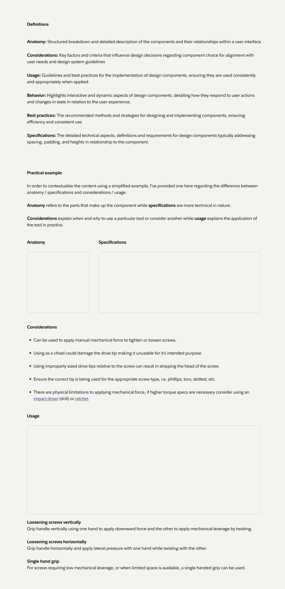

# Enterprise Documentation System Developer Guide

This comprehensive guide provides technical documentation about the implementation, architecture, and features of the Enterprise Documentation System (EDS). It is designed to help both junior and senior developers understand the codebase and get started quickly.



## Table of Contents

1. [Architecture Overview](#architecture-overview)
2. [Technology Stack](#technology-stack)
3. [Directory Structure](#directory-structure)
4. [Core Components](#core-components)
5. [Data Flow](#data-flow)
6. [Build Process](#build-process)
7. [Templating System](#templating-system)
8. [CSS Architecture](#css-architecture)
9. [JavaScript Implementation](#javascript-implementation)
10. [Content Migration System](#content-migration-system)
11. [Search Implementation](#search-implementation)
12. [Theme System](#theme-system)
13. [Navigation System](#navigation-system)
14. [Performance Optimizations](#performance-optimizations)
15. [Testing Strategy](#testing-strategy)
16. [Common Development Tasks](#common-development-tasks)
17. [Troubleshooting](#troubleshooting)
18. [Contributing Guidelines](#contributing-guidelines)

## Architecture Overview

The Enterprise Documentation System is built as a static site using the Eleventy (11ty) static site generator. It follows a component-based architecture with a focus on modularity, reusability, and performance.

### Key Architectural Principles

1. **Static Site Generation**: Content is pre-built at build time for optimal performance
2. **Component-Based Design**: UI components are modular and reusable
3. **Content as Data**: Content is treated as structured data with front matter
4. **Progressive Enhancement**: Core functionality works without JavaScript
5. **Responsive by Default**: Mobile-first approach with responsive components

### System Architecture Diagram

```
┌─────────────────────────────┐
│       Source Content        │
│  (Markdown, Nunjucks, etc.) │
└───────────────┬─────────────┘
                │
                ▼
┌─────────────────────────────┐
│         11ty Build          │
│  Process, Transform, Render │
└───────────────┬─────────────┘
                │
                ▼
┌─────────────────────────────┐
│      Static Site Output     │
│    HTML, CSS, JavaScript    │
└─────────────────────────────┘
```

## Technology Stack

The system uses the following technologies:

### Core Technologies

- **[Eleventy (11ty)](https://www.11ty.dev/)**: Static site generator
- **[Nunjucks](https://mozilla.github.io/nunjucks/)**: Templating language
- **[Markdown](https://www.markdownguide.org/)**: Content authoring format
- **[Tailwind CSS](https://tailwindcss.com/)**: Utility-first CSS framework
- **[Alpine.js](https://alpinejs.dev/)**: Lightweight JavaScript framework
- **[Node.js](https://nodejs.org/)**: JavaScript runtime for build tools

### Additional Libraries and Tools

- **[eleventy-navigation](https://github.com/11ty/eleventy-navigation)**: Navigation plugin for 11ty
- **[eleventy-plugin-syntaxhighlight](https://github.com/11ty/eleventy-plugin-syntaxhighlight)**: Code syntax highlighting
- **[PostCSS](https://postcss.org/)**: CSS processing tool
- **[Framer Motion](https://www.framer.com/motion/)**: Animation library
- **[Luxon](https://moment.github.io/luxon/)**: Date/time library
- **[markdown-it](https://github.com/markdown-it/markdown-it)**: Markdown parser

## Directory Structure

The codebase is structured as follows:

```
/
├── _site/                  # Built site output (not in repository)
├── scripts/                # Build and utility scripts
│   ├── migrate-cli.js      # Interactive migration CLI
│   ├── migrate.sh          # Shell script for migration
│   ├── import-repo.js      # Git repository import tool
│   ├── quick-migrate.js    # Core migration functionality
│   └── run-migration-test.js # Test migration script
├── src/                    # Source files
│   ├── _data/              # Global data files
│   │   ├── components.js   # Component metadata
│   │   ├── navigation.js   # Navigation structure
│   │   ├── site.js         # Site-wide configuration
│   │   └── versions.js     # Version information
│   ├── _includes/          # Templates and layouts
│   │   ├── components/     # Reusable UI components
│   │   │   ├── navigation/ # Navigation components
│   │   │   ├── layout/     # Layout components
│   │   │   └── feedback/   # Feedback components
│   │   └── layouts/        # Page layout templates
│   ├── _11ty/              # 11ty configuration
│   │   └── filters.js      # Custom 11ty filters
│   ├── assets/             # Static assets
│   │   ├── css/            # CSS files
│   │   ├── js/             # JavaScript files
│   │   │   ├── main.js     # Main JavaScript
│   │   │   ├── search.js   # Search functionality
│   │   │   └── theme.js    # Theme switcher
│   │   ├── fonts/          # Font files
│   │   └── images/         # Image files
│   ├── components/         # Component documentation
│   ├── design-tokens/      # Design system tokens
│   ├── patterns/           # Design patterns
│   ├── navigation/         # Navigation views
│   │   ├── by-channel/     # Channel-specific navigation
│   │   ├── by-type/        # Type-based navigation
│   │   └── by-owner/       # Team-based navigation
│   ├── migrated/           # Migrated content
│   └── utils/              # Utility functions
│       └── migration/      # Migration utilities
│           ├── html-to-md.js # HTML to Markdown converter
│           ├── njk-to-md.js  # Nunjucks to Markdown converter
│           ├── legacy-parser.js # Legacy format parser
│           ├── md-formatter.js  # Markdown formatter
│           └── xml-to-md.js     # XML to Markdown converter
├── .eleventy.js            # Eleventy configuration
├── tailwind.config.js      # Tailwind CSS configuration
├── postcss.config.js       # PostCSS configuration
└── package.json            # Project dependencies
```

## Core Components

The system is built around these core components:

### Page Structure Components

- **Base Layout (`src/_includes/layouts/base.njk`)**: The foundational layout template
- **Header Component (`src/_includes/components/layout/header.njk`)**: Site header with navigation
- **Footer Component (`src/_includes/components/layout/footer.njk`)**: Site footer
- **Sidebar Navigation (`src/_includes/components/navigation/sidebar.njk`)**: Documentation sidebar

### Documentation Components

- **Component Layout (`src/_includes/layouts/component.njk`)**: Layout for component documentation
- **Design Token Layout (`src/_includes/layouts/design-token.njk`)**: Layout for design token docs
- **Code Blocks (`src/_includes/components/code-block.njk`)**: Syntax-highlighted code examples
- **Example Blocks (`src/_includes/components/example.njk`)**: Live component examples

### Interactive Components

- **Accordion (`src/components/layout/accordion/`)**: Collapsible content sections
- **Tabs (`src/components/layout/tabs/`)**: Tabbed interface for content organization
- **Search (`src/assets/js/search.js`)**: Site-wide search functionality
- **Theme Switcher (`src/assets/js/theme.js`)**: Light/dark mode theme toggle

## Data Flow

The documentation system uses a data flow pattern where:

1. **Content as Data**: Markdown files contain front matter that defines metadata
2. **Global Data**: Global data files in `src/_data/` provide site-wide configuration
3. **Collection Processing**: Eleventy collections group and organize content
4. **Template Rendering**: Templates combine content and data to generate HTML

```
┌──────────────┐    ┌──────────────┐    ┌──────────────┐
│  Markdown &  │    │   Eleventy   │    │  Templates   │
│ Front Matter ├───►│ Collections  ├───►│    (Njk)     │
└──────────────┘    └──────────────┘    └──────┬───────┘
       ▲                                       │
       │                                       ▼
┌──────┴───────┐                       ┌──────────────┐
│ Global Data  │                       │  HTML Output │
└──────────────┘                       └──────────────┘
```

### Key Data Sources

- **Front Matter**: YAML front matter in Markdown files defines page metadata
- **`components.js`**: Defines component metadata and relationships
- **`navigation.js`**: Defines navigation structure for the site
- **`site.js`**: Contains site-wide configuration values
- **`versions.js`**: Contains version information for documentation

## Build Process

The build process converts source files into the static site:

### Build Steps

1. **Preprocessing**: Tailwind CSS processes utility classes
2. **Content Processing**: Markdown is processed into HTML
3. **Template Rendering**: Nunjucks templates render the final HTML
4. **Asset Processing**: Static assets are copied to the output directory
5. **Post-processing**: Additional transformations like minification are applied

### Build Commands

```bash
# Development build with watch mode
npx @11ty/eleventy --serve

# Production build
npx @11ty/eleventy

# Build with specific output directory
npx @11ty/eleventy --output=./dist
```

## Templating System

The system uses Nunjucks as the primary templating language.

### Key Templating Patterns

#### Layout Inheritance

```njk



  <!-- Page-specific content -->

```

#### Component Inclusion

```njk

```

#### Macros for Reusable Components

```njk


{{ button({
  text: "Submit",
  variant: "primary",
  size: "md"
}) }}
```

#### Custom Shortcodes

```njk

<button class="eds-button eds-button--primary">Click Me</button>

```

## CSS Architecture

The CSS is built using Tailwind CSS with custom components.

### CSS Structure

1. **Base Styles**: Basic global styles and resets
2. **Component Styles**: Styles specific to individual components
3. **Utility Classes**: Tailwind utility classes for layout and styling

### BEM Methodology with Tailwind

The system uses BEM naming combined with Tailwind:

```html
<div class="eds-card">
  <div class="eds-card__header">
    <h2 class="eds-card__title text-xl font-bold">Card Title</h2>
  </div>
  <div class="eds-card__body">
    <p class="text-gray-700 dark:text-gray-300">Card content goes here.</p>
  </div>
</div>
```

### Theme System

The CSS includes support for light and dark themes:

```css
:root {
  --eds-color-primary: #0055FF;
  --eds-color-background: #FFFFFF;
}

.dark {
  --eds-color-primary: #5C9AFF;
  --eds-color-background: #1A1A1A;
}
```

## JavaScript Implementation

The system uses a modular JavaScript approach with Alpine.js.

### JavaScript Organization

- **Core Utilities**: Helper functions in `utils.js`
- **Feature Modules**: Functionality grouped by feature
- **Component Logic**: Component-specific behavior

### Alpine.js Implementation

Alpine.js provides declarative component behavior:

```html
<div x-data="{ open: false }">
  <button @click="open = !open">Toggle</button>
  <div x-show="open" x-transition>
    Content
  </div>
</div>
```

### Search Implementation

The search functionality is implemented in `search.js`:

1. **Content Indexing**: Content is indexed at build time
2. **Client-Side Search**: JS performs searching against the index
3. **Result Rendering**: Results are displayed in the search UI

## Content Migration System

The migration system converts content from various formats to the EDS format.

### Migration Architecture

```
┌─────────────────┐
│ Source Content  │
└────────┬────────┘
         │
         ▼
┌─────────────────┐
│ Format Detection│
└────────┬────────┘
         │
         ▼
┌─────────────────┐
│ Format-Specific │
│   Converters    │
└────────┬────────┘
         │
         ▼
┌─────────────────┐
│    Markdown     │
│   Formatting    │
└────────┬────────┘
         │
         ▼
┌─────────────────┐
│  Output Files   │
└─────────────────┘
```

### Migration Utilities

- **`njk-to-md.js`**: Converts Nunjucks templates to Markdown
- **`html-to-md.js`**: Converts HTML to Markdown
- **`xml-to-md.js`**: Converts XML formats to Markdown
- **`legacy-parser.js`**: Handles proprietary legacy formats
- **`md-formatter.js`**: Standardizes Markdown formatting

### Migration Process

1. **Source Detection**: Identify the format of source files
2. **Content Extraction**: Extract content from the source format
3. **Format Conversion**: Convert to standardized Markdown
4. **Metadata Preservation**: Preserve and enhance front matter
5. **Asset Processing**: Process and copy related assets
6. **Output Generation**: Write converted files to destination

## Search Implementation

The search system is a client-side implementation using JavaScript.

### Search Architecture

1. **Content Indexing**: Content is extracted and indexed from page content
2. **Search Index**: A lightweight search index is created
3. **Query Processing**: User queries are processed and matched against the index
4. **Result Ranking**: Results are ranked by relevance
5. **Result Display**: Matched results are displayed to the user

### Search Features

- **Full-Text Search**: Searches across all content
- **Keyword Highlighting**: Highlights matched terms in results
- **Relevance Sorting**: Orders results by relevance score
- **Faceted Search**: Filter by content type or section

## Theme System

The theme system supports light and dark modes.

### Theme Implementation

1. **Theme Storage**: User preference is stored in localStorage
2. **System Preference Detection**: Detects OS theme preference
3. **Theme Application**: Applies theme classes to HTML element
4. **Component Theming**: Components respond to theme changes

### Theme Toggle Implementation

```javascript
// Simplified version of theme toggle logic
function toggleTheme() {
  const currentTheme = localStorage.getItem('theme') || 'light';
  const newTheme = currentTheme === 'light' ? 'dark' : 'light';
  
  document.documentElement.classList.remove(currentTheme);
  document.documentElement.classList.add(newTheme);
  localStorage.setItem('theme', newTheme);
}
```

## Navigation System

The navigation system is multi-faceted, supporting different views of the content.

### Navigation Implementation

- **Hierarchical Structure**: Defined in `src/_data/navigation.js`
- **eleventy-navigation**: Used for automatic navigation generation
- **Custom Views**: Specialized views by channel, type, and owner

### Navigation Generation

1. **Front Matter**: Pages declare their place in navigation
2. **Collection Processing**: Eleventy processes collections into navigation
3. **Template Rendering**: Navigation templates render the structure

### Example Navigation Front Matter

```yaml
---
title: Button Component
eleventyNavigation:
  key: Button
  parent: Components
  order: 100
---
```

## Performance Optimizations

The system includes several performance optimizations:

### Build-Time Optimizations

- **Asset Minification**: CSS and JS files are minified
- **Image Optimization**: Images are optimized for web
- **Critical CSS**: Critical CSS is inlined in page head

### Runtime Optimizations

- **Lazy Loading**: Images and components load lazily
- **Code Splitting**: JavaScript is split for efficient loading
- **Caching Strategy**: Efficient cache headers for assets

## Testing Strategy

The system includes a comprehensive testing approach:

### Testing Levels

1. **Unit Tests**: For utility and helper functions
2. **Component Tests**: For individual UI components
3. **Integration Tests**: For page composition
4. **End-to-End Tests**: For full user flows

### Migration Testing

The migration system includes specialized testing:

```bash
# Test migration functionality
node scripts/run-migration-test.js

# Test with custom sample files
node scripts/run-migration-test.js --source=custom-samples
```

## Common Development Tasks

This section covers common tasks developers will perform:

### Adding a New Component

To add a new component to the documentation system, follow these steps:

1. **Create Component Files**:
   ```
   src/components/[category]/[component-name]/
   ├── index.md           # Main component documentation (Design tab)
   ├── code.md            # Code documentation 
   ├── accessibility.md   # Accessibility documentation
   └── examples.md        # Examples of component usage
   ```

2. **Add Component to Navigation**:
   - Edit `src/_data/navigation.js` to add your component to the appropriate category:
   ```javascript
   {
     title: "Category Name",
     items: [
       // Existing components...
       {
         title: "New Component",
         url: "/components/category/component-name/",
         status: "stable" // or "experimental" or "deprecated"
       }
     ]
   }
   ```

3. **Create Component Front Matter**:
   Ensure each component file includes the proper front matter:
   ```yaml
   ---
   layout: layouts/component.njk
   title: Component Name
   description: A brief description of the component
   category: category-name
   version: 1.0.0
   ---
   ```

4. **Implement Component Sections**:
   - `index.md`: Design guidelines, anatomy, usage, best practices
   - `code.md`: Implementation details, code samples, API reference
   - `accessibility.md`: Accessibility considerations and guidelines
   - `examples.md`: Interactive examples and variations

5. **Test Navigation**:
   - Restart the development server if needed
   - Verify your component appears in the navigation
   - Test all component tabs (Design, Code, Accessibility, Examples)

> **Note**: Components will not appear in the left navigation unless they are specifically added to the `src/_data/navigation.js` file, even if the component files exist in the correct location.

### Creating a New Layout

1. Create layout template in `src/_includes/layouts/new-layout.njk`
2. Extend the base layout or another parent layout
3. Define content blocks and injection points
4. Document the layout usage

### Adding a New Documentation Section

1. Create section index in `src/new-section/index.md`
2. Add section to navigation in `src/_data/navigation.js`
3. Create content pages in the section directory
4. Link section in appropriate navigation views

### Modifying the Theme

1. Update theme variables in `src/assets/css/variables.css`
2. Add theme-specific styles to components
3. Update theme toggle in `src/assets/js/theme.js`
4. Test in both light and dark modes

## Troubleshooting

Common issues and their solutions:

### Build Errors

- **Template Errors**: Check Nunjucks syntax in templates
- **Front Matter Errors**: Validate YAML syntax in front matter
- **Module Errors**: Ensure all dependencies are installed

### Layout Issues

- **Layout Inheritance Problems**: Check block names and parent templates
- **CSS Conflicts**: Inspect element to find conflicting styles
- **Responsive Issues**: Test on multiple viewport sizes

### Migration Issues

- **Format Detection Failures**: Check file extensions and content detection
- **Conversion Errors**: Check specific format converter logs
- **Missing Assets**: Verify asset paths and copying process

## Contributing Guidelines

For developers contributing to the project:

### Contribution Process

1. **Fork the Repository**: Create your own fork
2. **Create a Branch**: Make changes in a feature branch
3. **Follow Code Standards**: Adhere to project coding standards
4. **Write Tests**: Include tests for new functionality
5. **Submit PR**: Create a pull request with a clear description

### Code Standards

- **JavaScript**: Follow ESLint configuration
- **CSS**: Follow BEM methodology with Tailwind conventions
- **Templates**: Follow Nunjucks best practices
- **Markdown**: Use consistent formatting and front matter

### Commit Message Format

```
feat(component): add new carousel component

- Implements responsive carousel
- Adds keyboard navigation
- Includes ARIA attributes for accessibility
```

## Advanced Topics

### Custom 11ty Plugins

Creating custom 11ty plugins:

```javascript
// Example plugin
module.exports = function(eleventyConfig) {
  eleventyConfig.addFilter("myCustomFilter", function(value) {
    // Filter implementation
    return transformedValue;
  });
  
  eleventyConfig.addShortcode("myShortcode", function(content) {
    // Shortcode implementation
    return `<div class="custom-wrapper">${content}</div>`;
  });
};
```

### Creating Custom Converters

Adding support for new content formats:

```javascript
// src/utils/migration/custom-format.js
async function convertCustomFormat(source, dest, options = {}) {
  // Read source file
  const content = await fs.readFile(source, 'utf8');
  
  // Parse source format
  const parsed = parseCustomFormat(content);
  
  // Convert to markdown
  const markdown = convertToMarkdown(parsed);
  
  // Write output file
  await fs.writeFile(dest, markdown, 'utf8');
  
  return { status: 'success', path: dest };
}

module.exports = { convertCustomFormat };
```

## Reference

### Useful Commands

```bash
# Install dependencies
npm install

# Start development server
npm run start

# Build for production
npm run build

# Run migration
./scripts/migrate.sh

# Run interactive migration CLI
node scripts/migrate-cli.js

# Import repository
node scripts/import-repo.js <repo-url>

# Test migration
node scripts/run-migration-test.js
```

### Important Files

- `.eleventy.js`: Main Eleventy configuration
- `tailwind.config.js`: Tailwind CSS configuration
- `src/_data/site.js`: Global site configuration
- `src/_data/navigation.js`: Navigation structure
- `src/_includes/layouts/base.njk`: Base layout template

### External Documentation

- [Eleventy Documentation](https://www.11ty.dev/docs/)
- [Nunjucks Documentation](https://mozilla.github.io/nunjucks/templating.html)
- [Tailwind CSS Documentation](https://tailwindcss.com/docs)
- [Alpine.js Documentation](https://alpinejs.dev/start-here)