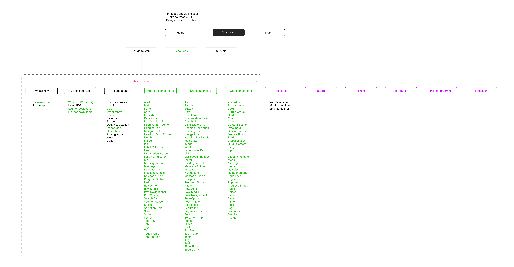

# Enterprise Documentation Migration Guide

This comprehensive guide details the process for migrating legacy documentation from various sources into the unified Enterprise Documentation System (EDS). Our toolkit provides multiple approaches to accommodate different migration needs, from simple one-command migrations to complex integrations.



## 📋 Prerequisites

- **Node.js 14+** installed
- **npm** or **yarn** package manager
- **Git** for version control and repository access
- Access to your legacy documentation repositories
- Basic familiarity with the command line

## 🔍 Understanding the Migration Process

Before starting the migration, it's helpful to understand how the process works:

1. **Source Detection**: The system identifies your source content format (Markdown, Nunjucks, HTML, XML, etc.)
2. **Content Extraction**: Content is extracted from the source files, preserving structure and metadata
3. **Formatting Conversion**: Content is converted to standardized Markdown with front matter
4. **Asset Processing**: Images and other assets are copied and paths updated
5. **Navigation Integration**: The content is integrated into the site's navigation structure
6. **Final Validation**: Links and references are checked and validated

## 🚀 Migration Options

### Option 1: Interactive CLI Tool (Recommended)

We've created an interactive CLI tool that walks you through the migration process:

```bash
# Make the script executable
chmod +x scripts/migrate-cli.js

# Run the migration tool
node scripts/migrate-cli.js
```

The CLI tool will:
1. Ask you which migration mode you want to use
2. Guide you through setting up your repositories
3. Run the migration process
4. Offer to build and serve the site

### Option 2: Configuration File

1. Edit `scripts/migration-config.js` to specify your source repositories:

```javascript
module.exports = {
  sources: [
    { 
      path: "/absolute/path/to/first-repo", 
      name: "product-docs" 
    },
    // Add more repos as needed
  ],
  // Other configuration options...
};
```

2. Run using the shell script:

```bash
# Make the script executable
chmod +x scripts/migrate.sh

# Run the migration
./scripts/migrate.sh
```

This will:
- Run the migration process
- Build the site
- Provide instructions for viewing the results

### Option 3: Git Repository Import

To directly import and migrate a Git repository:

```bash
# Run the import tool
node scripts/import-repo.js https://github.com/username/repo.git [repo-name]
```

### Option 4: Test Migration

To test the migration process with sample files:

```bash
# Run the test migration
node scripts/run-migration-test.js
```

## Review the Results

1. Check the migration report at `src/migrated/migration-report.md`
2. Browse the migrated content in your browser at http://localhost:5000/migrated/
3. Verify navigation and links are working correctly

## 📄 Supported Source Formats and Conversion Process

The migration toolkit supports a wide range of source formats:

### Markdown (.md)
- **Process**: Enhanced with proper front matter and standardized formatting
- **Enhancements**: 
  - Heading levels are normalized
  - Code blocks are properly formatted
  - Table formatting is improved
  - Links are validated and fixed

### Nunjucks Templates (.njk)
- **Process**: Converted to Markdown while preserving layout information
- **Handling**:
  - Template tags are processed or removed based on configuration
  - Variables are preserved or replaced with placeholder content
  - Layout references are mapped to EDS layouts

### HTML (.html)
- **Process**: Converted to semantic Markdown
- **Features**:
  - Structure is preserved (headings, lists, tables)
  - Classes and IDs are converted to appropriate Markdown syntax
  - Images and links are processed and paths updated

### XML-based Formats
- **DITA XML**: Converted preserving topic types (concept, task, reference)
- **DocBook**: Converted with special handling for chapters and sections
- **Custom XML**: Configurable conversion based on schema

### Other Assets
- **Images**: Copied to the appropriate assets directory
- **PDFs & Documents**: Copied and linked appropriately
- **Code samples**: Preserved with proper syntax highlighting

### Legacy Proprietary Formats
- **Process**: Detected and processed with specialized converters
- **Formats**: Internal wiki formats, custom XML, RTF documents

## ⚙️ Advanced Configuration Options

The migration process can be customized through the configuration file:

```javascript
// scripts/migration-config.js
module.exports = {
  // Source repositories to migrate
  sources: [
    { 
      path: "/path/to/repo", 
      name: "product-docs",
      // Optional source-specific settings
      options: {
        include: ["docs/**/*.md", "guides/**/*.html"],
        exclude: ["**/drafts/**", "**/archive/**"],
        layoutMap: {
          "old-layout.njk": "layouts/guide.njk"
        }
      }
    }
  ],
  
  // Global destination directory for migrated content
  destRoot: "./src/migrated",
  
  // Global content processing options
  options: {
    // Format options
    preserveHeadingLevels: false,
    topHeadingLevel: 1,
    
    // Layout mapping from legacy to EDS
    layoutMap: {
      "default.html": "layouts/page.njk",
      "api.html": "layouts/api.njk",
      "tutorial.html": "layouts/guide.njk"
    },
    
    // Front matter defaults to add to all migrated content
    frontMatterDefaults: {
      eleventyNavigation: {
        parent: "Migrated Content"
      },
      migrated: true,
      layout: "layouts/migrated.njk"
    },
    
    // Asset handling
    assets: {
      copyAssets: true,
      assetDir: "assets",
      updatePaths: true
    },
    
    // Custom converters for special formats
    customConverters: {
      ".custom": "src/utils/migration/custom-converter.js"
    }
  },
  
  // Reporting options
  reporting: {
    generateReport: true,
    reportPath: "src/migrated/migration-report.md",
    detailedStats: true,
    errorThreshold: "warning" // 'none', 'error', 'warning', 'info'
  }
};
```

## 🔍 Troubleshooting Common Issues

### Content Not Appearing in Navigation

**Problem**: Migrated content doesn't show up in the site navigation.  
**Solution**: 
1. Check that front matter includes the `eleventyNavigation` property
2. Verify that the parent key exists in the navigation structure
3. Add the migrated section to `src/_data/navigation.js`

### Broken Links Within Migrated Content

**Problem**: Internal links between migrated pages don't work.  
**Solution**:
1. Run the link validation tool: `node scripts/validate-links.js`
2. Check the migration report for link issues
3. Update links manually or use the batch link fixer tool:
   ```bash
   node scripts/fix-links.js --source=src/migrated --pattern="oldpath" --replace="newpath"
   ```

### Missing or Broken Images

**Problem**: Images in migrated content don't display.  
**Solution**:
1. Verify that image files were copied to the assets directory
2. Check image paths in the markdown are correct
3. Run the image path fixer:
   ```bash
   node scripts/fix-image-paths.js --dir=src/migrated
   ```

### Formatting Issues in Converted Content

**Problem**: Complex formatting doesn't convert properly.  
**Solution**:
1. Identify problematic patterns in the source content
2. Configure custom transformer rules in `src/utils/migration/md-formatter.js`
3. Re-run the migration for affected files

### Character Encoding Problems

**Problem**: Special characters appear as gibberish.  
**Solution**:
1. Check source file encoding (should be UTF-8)
2. Add encoding option to the migration config:
   ```javascript
   options: {
     sourceEncoding: 'utf8', // or other encodings as needed
     outputEncoding: 'utf8'
   }
   ```

## 📊 Post-Migration Tasks and Best Practices

After successfully migrating your content, follow these best practices:

### Quality Assurance

1. **Visual Inspection**:
   - Review a sample of migrated pages across different content types
   - Compare with original source for completeness

2. **Automated Testing**:
   - Run link validation: `node scripts/validate-links.js`
   - Check for accessibility issues: `node scripts/a11y-check.js`
   - Validate HTML output: `node scripts/validate-html.js`

3. **Content Enhancement**:
   - Add appropriate tags to improve searchability
   - Standardize headings and formatting
   - Improve metadata with descriptive titles and descriptions

### Integration into Main Navigation

1. Update site navigation in `src/_data/navigation.js` to include migrated content:
   ```javascript
   {
     title: "Product Documentation",
     url: "/migrated/product-docs/",
     description: "Detailed product documentation",
     children: [
       // This can be auto-generated based on migrated content structure
     ]
   }
   ```

2. Create specialized navigation views:
   - By product: `src/navigation/by-product/`
   - By documentation type: `src/navigation/by-type/`

### Content Refinement

1. **Front Matter Enhancement**:
   - Add relevant tags
   - Update descriptions
   - Set proper publication dates

2. **Markdown Improvements**:
   - Replace generic headings with more descriptive ones
   - Add code language specifiers to code blocks
   - Add alt text to images

## 🔄 Continuous Migration Process

For ongoing documentation migration, establish a continuous process:

1. **Set up scheduled migrations** for regularly updated content:
   ```bash
   # Create a cron job or scheduled task
   0 2 * * * cd /path/to/project && ./scripts/migrate.sh --source=updated-repo
   ```

2. **Create migration webhooks** for triggering on source repository updates:
   - Configure in `scripts/migration-webhook.js`
   - Deploy as a serverless function or small service

3. **Track migration statistics** to measure progress:
   - Use the `migration-stats.json` file generated with each run
   - Compare results over time to monitor improvement

## 🛠️ Extending the Migration Toolkit

For specialized needs, you can extend the toolkit:

1. **Create custom format converters** in `src/utils/migration/`:
   ```javascript
   // src/utils/migration/my-custom-format.js
   async function convertCustomFormat(source, dest, options = {}) {
     // Your conversion logic here
     return { status: 'success', path: dest };
   }
   
   module.exports = { convertCustomFormat };
   ```

2. **Register your converter** in `src/utils/migration/index.js`:
   ```javascript
   const { convertCustomFormat } = require('./my-custom-format');
   
   module.exports = {
     // Other converters...
     customFormat: { convertCustomFormat }
   };
   ```

3. **Add format detection** in `scripts/quick-migrate.js`:
   ```javascript
   function detectFormat(filePath) {
     if (filePath.endsWith('.custom')) {
       return 'customFormat';
     }
     // Other format detection logic...
   }
   ```

For more advanced options and customization, refer to:
- `scripts/quick-migrate.js` - Core migration functionality
- `scripts/migration-config.js` - Configuration options
- `src/utils/migration/` - Individual converters for different formats