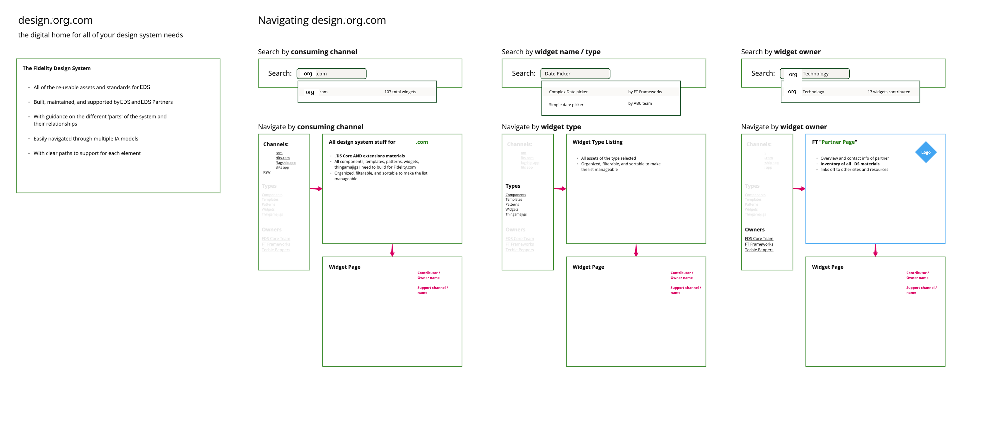

# Enterprise Documentation System Quickstart Guide

This quickstart guide will help you get up and running with the Enterprise Documentation System (EDS) in minutes. Follow these steps to start developing, creating content, and customizing the system.



## Prerequisites

Before you begin, ensure you have the following installed:

- **Node.js** (version 14 or higher)
- **npm** or **yarn** package manager
- **Git** for version control

## Quick Installation

1. **Clone the repository:**

   ```bash
   git clone https://github.com/your-username/enterprise-documentation-system.git
   cd enterprise-documentation-system
   ```

2. **Install dependencies:**

   ```bash
   npm install
   # OR
   yarn install
   ```

3. **Start the development server:**

   ```bash
   npm run start
   # OR
   yarn start
   ```

4. **Open your browser** and navigate to [http://localhost:5000](http://localhost:5000)

## Quick Content Creation

### Creating a Simple Page

1. Create a new Markdown file in the appropriate directory:

   ```bash
   echo '---
   title: My New Page
   description: A description of my new page
   layout: layouts/page.njk
   eleventyNavigation:
     key: MyNewPage
     parent: Documentation
     order: 100
   ---
   
   # My New Page
   
   This is a new page in the documentation system.
   ' > src/documentation/my-new-page.md
   ```

2. The page will automatically appear in the navigation under "Documentation"

### Creating a Component Documentation Page

1. Create a component documentation file:

   ```bash
   mkdir -p src/components/my-category
   echo '---
   title: My Component
   description: Documentation for My Component
   layout: layouts/component.njk
   eleventyNavigation:
     key: MyComponent
     parent: Components
     order: 100
   status: stable
   tags:
     - UI
     - Component
   ---
   
   ## Overview
   
   Description of the component and its purpose.
   
   ## Usage
   
   How to use the component.
   
   ## Examples
   
   ```html
   <div class="my-component">Example</div>
   ```
   
   ## API Reference
   
   | Property | Type | Description |
   | -------- | ---- | ----------- |
   | prop1    | string | Description |
   | prop2    | number | Description |
   ' > src/components/my-category/my-component.md
   ```

## Quick Theming

### Customizing Colors

1. Edit the Tailwind configuration in `tailwind.config.js`:

   ```javascript
   module.exports = {
     theme: {
       extend: {
         colors: {
           'eds-primary': '#0055FF',   // Change to your primary color
           'eds-secondary': '#17C3B2', // Change to your secondary color
           'eds-accent': '#FFC857',    // Change to your accent color
         }
       }
     }
   }
   ```

2. Update CSS variables in `src/assets/css/variables.css`:

   ```css
   :root {
     --eds-color-primary: #0055FF;   /* Change to your primary color */
     --eds-color-secondary: #17C3B2; /* Change to your secondary color */
     --eds-color-accent: #FFC857;    /* Change to your accent color */
   }
   
   .dark {
     --eds-color-primary: #5C9AFF;   /* Change to your dark mode primary color */
     --eds-color-secondary: #2FDED8; /* Change to your dark mode secondary color */
     --eds-color-accent: #FFD176;    /* Change to your dark mode accent color */
   }
   ```

### Customizing Fonts

1. Add your custom fonts to `src/assets/fonts/`

2. Update the font variables in `src/assets/css/variables.css`:

   ```css
   :root {
     --eds-font-heading: 'Your Heading Font', sans-serif;
     --eds-font-body: 'Your Body Font', sans-serif;
     --eds-font-code: 'Your Code Font', monospace;
   }
   ```

3. Update the Tailwind configuration in `tailwind.config.js`:

   ```javascript
   module.exports = {
     theme: {
       extend: {
         fontFamily: {
           'eds-heading': ['var(--eds-font-heading)', 'sans-serif'],
           'eds-body': ['var(--eds-font-body)', 'sans-serif'],
           'eds-code': ['var(--eds-font-code)', 'monospace']
         }
       }
     }
   }
   ```

## Quick Migration

### Migrating a Repository

1. Run the migration script:

   ```bash
   # Make the script executable
   chmod +x scripts/migrate.sh
   
   # Run the migration with a repository URL
   ./scripts/migrate.sh --source=/path/to/repository
   ```

2. Follow the on-screen instructions to complete the migration

3. Access your migrated content at [http://localhost:5000/migrated/](http://localhost:5000/migrated/)

### Testing the Migration

1. Run the test migration:

   ```bash
   node scripts/run-migration-test.js
   ```

2. Check the generated test files in `example-files/migrated/`

## Quick Component Creation

### Creating a Reusable Component

1. Create a new component template in `src/_includes/components/`:

   ```bash
   mkdir -p src/_includes/components/my-category
   echo '{# src/_includes/components/my-category/my-component.njk #}
   
     <div class="eds-my-component eds-my-component--{{ props.variant }}">
       
         <h3 class="eds-my-component__title">{{ props.title }}</h3>
       
       <div class="eds-my-component__content">
         {{ props.content | safe }}
       </div>
     </div>
   
   ' > src/_includes/components/my-category/my-component.njk
   ```

2. Use the component in your templates:

   ```njk
   
   
   {{ myComponent({
     title: "Component Title",
     content: "<p>Component content</p>",
     variant: "primary"
   }) }}
   ```

## Quick Configuration Changes

### Updating Site Metadata

1. Edit `src/_data/site.js`:

   ```javascript
   module.exports = {
     title: "Your Documentation Title",
     description: "Your documentation description",
     baseUrl: "https://docs.yourdomain.com",
     repo: "https://github.com/your-username/your-repo",
     env: process.env.ELEVENTY_ENV || "development",
     buildTime: new Date()
   };
   ```

### Updating Navigation Structure

1. Edit `src/_data/navigation.js`:

   ```javascript
   module.exports = {
     main: [
       {
         title: "Getting Started",
         url: "/getting-started/"
       },
       {
         title: "Components",
         url: "/components/",
         children: [
           {
             title: "My Component",
             url: "/components/my-category/my-component/"
           }
         ]
       }
     ]
   };
   ```

## Common Tasks Reference

### Building for Production

```bash
# Build for production
npm run build:prod
# OR
yarn build:prod

# The output will be in the _site directory
```

### Creating a New Section

1. Create a directory for the section:

   ```bash
   mkdir -p src/new-section
   ```

2. Create an index file for the section:

   ```bash
   echo '---
   title: New Section
   description: Description of the new section
   layout: layouts/section.njk
   eleventyNavigation:
     key: NewSection
     order: 100
   ---
   
   # New Section
   
   Welcome to the new section.
   ' > src/new-section/index.md
   ```

3. Add content pages to the section with appropriate front matter

### Adding a Custom Template Filter

1. Edit `.eleventy.js`:

   ```javascript
   module.exports = function(eleventyConfig) {
     // Add a custom filter
     eleventyConfig.addFilter("myFilter", function(value) {
       // Your filter logic here
       return transformedValue;
     });
     
     // Rest of your config...
   };
   ```

2. Use the filter in templates:

   ```njk
   {{ someValue | myFilter }}
   ```

### Adding a Custom Shortcode

1. Edit `.eleventy.js`:

   ```javascript
   module.exports = function(eleventyConfig) {
     // Add a shortcode
     eleventyConfig.addShortcode("myShortcode", function(content) {
       return `<div class="custom-wrapper">${content}</div>`;
     });
     
     // Rest of your config...
   };
   ```

2. Use the shortcode in templates:

   ```njk
   
   ```

## Troubleshooting

### Common Issues

1. **Server won't start**:
   - Check that port 5000 is not in use
   - Check Node.js version (should be 14+)
   - Check for errors in terminal output

2. **Styles not applying**:
   - Ensure Tailwind is processing correctly
   - Check for CSS syntax errors
   - Clear browser cache

3. **Navigation not showing new pages**:
   - Verify front matter includes `eleventyNavigation`
   - Check that `key` and `parent` values are correct
   - Restart the development server

4. **Migration errors**:
   - Check file permissions
   - Verify source repository path
   - Check for format-specific errors in the console

## Getting Help

If you need additional help:

1. **Check the documentation**:
   - [README.md](README.md)
   - [MIGRATION.md](MIGRATION.md)
   - [DEVELOPERS.md](DEVELOPERS.md)
   - [API.md](API.md)

2. **Submit an issue** on the GitHub repository

3. **Contact the maintenance team** for urgent issues

## Next Steps

Now that you're up and running, consider:

1. **Exploring the example components** to understand the system
2. **Creating your own components** for specialized needs
3. **Customizing the theme** to match your brand
4. **Migrating your existing documentation** to the new system

Happy documenting!