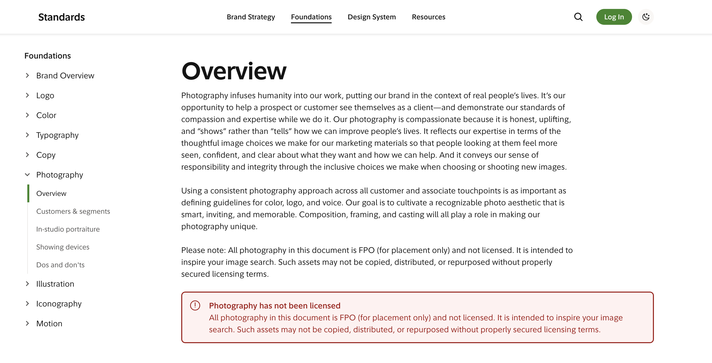

# Enterprise Documentation System

A unified 11ty-based documentation platform that consolidates content from multiple legacy sites, providing a robust and modular documentation experience with enhanced user interaction and performance.



## 🚀 Features

- **11ty (Eleventy)** static site generator for fast performance
- **Tailwind CSS** for responsive and customizable styling
- **Alpine.js** for interactive components
- **Dark/Light mode** support with system preference detection
- **Advanced search** functionality with content indexing
- **Multiple navigation perspectives** (by channel, type, owner)
- **Comprehensive migration toolkit** for legacy content
- **Responsive design** for all devices
- **Accessibility focused** implementation

## 🔄 Migration Features

- Command-line migration tools for legacy repositories
- Support for multiple source repositories
- Automated conversion of Nunjucks templates to Markdown
- Formatting and standardization of migrated content
- Migration reports and issue tracking

## 🚀 Getting Started

### Prerequisites

- **Node.js 14+** installed
- **npm** or **yarn** package manager
- **Git** for version control
- Basic familiarity with Eleventy and Nunjucks (helpful but not required)

### Detailed Installation Steps

1. **Clone the repository**:
   ```bash
   git clone https://github.com/your-username/enterprise-documentation-system.git
   cd enterprise-documentation-system
   ```

2. **Install dependencies**:
   ```bash
   npm install
   # OR if you prefer yarn
   yarn install
   ```

3. **Run the development server**:
   ```bash
   npx @11ty/eleventy --serve
   # OR the shorthand version
   npx eleventy --serve
   # OR with npm script
   npm run start
   ```

4. **Access the site** at `http://localhost:5000` in your browser

### Project Configuration

- Edit site metadata in `src/_data/site.js`
- Modify navigation structure in `src/_data/navigation.js`
- Update component data in `src/_data/components.js`
- Customize Tailwind configuration in `tailwind.config.js`

### Build for Production

```bash
# Build the site for production
npx @11ty/eleventy

# The built site will be in the _site directory
```

## 🔄 Content Migration Guide

See [MIGRATION.md](MIGRATION.md) for comprehensive instructions on migrating legacy content to this platform.

### Migration Quick Start

```bash
# Make the migration scripts executable
chmod +x scripts/migrate.sh
chmod +x scripts/migrate-cli.js

# Run the interactive migration CLI
node scripts/migrate-cli.js

# OR directly import from a Git repository
node scripts/import-repo.js https://github.com/username/legacy-docs.git
```

### Setting Up Your Migration

1. **Define your source repositories** in `scripts/migration-config.js`:
   ```javascript
   module.exports = {
     sources: [
       { 
         path: "/path/to/first-repo", 
         name: "product-docs" 
       },
       // Add more repos as needed
     ],
     destRoot: "./src/migrated",
     // Other configuration options...
   };
   ```

2. **Run the migration** using one of the following methods:

   **Option 1: Interactive CLI** (recommended for beginners)
   ```bash
   node scripts/migrate-cli.js
   ```
   This will:
   - Guide you through the migration process step-by-step
   - Provide options for different migration types
   - Help troubleshoot common issues

   **Option 2: One-command migration**
   ```bash
   ./scripts/migrate.sh
   ```
   This runs the migration, builds the site, and provides instructions.

   **Option 3: Direct Git repository import**
   ```bash
   node scripts/import-repo.js https://github.com/username/repo.git [repo-name]
   ```
   This clones the repo and migrates its content automatically.

3. **Review the migration report** generated at `src/migrated/migration-report.md` to:
   - See statistics on the migrated content
   - Find and fix any errors
   - Verify all content was migrated correctly

4. **Test the migrated content** by accessing it at `http://localhost:5000/migrated/`

### Supported Source Formats

The migration tools support the following formats:

- **Markdown (.md)** - Copied with formatting improvements
- **Nunjucks (.njk)** - Converted to Markdown with layout preservation
- **HTML (.html)** - Converted to basic Markdown
- **XML-based formats** - DITA and DocBook conversion
- **Other files** - Images, PDFs, etc. are copied as-is

### Automating Migration

For automated CI/CD pipelines, you can use the scripted approach:

```javascript
const { migrate } = require('./scripts/quick-migrate');

// Custom migration configuration
const config = {
  sources: [{ path: '/path/to/repo', name: 'api-docs' }],
  destRoot: './src/migrated',
  layoutMap: {
    'legacy_api': 'layouts/api.njk'
  }
};

// Run the migration
migrate(config).then(() => {
  console.log('Migration complete!');
}).catch(err => {
  console.error('Migration failed:', err);
});
```

## 📚 Working with Content

### Adding a New Component

1. Create a new Markdown file in the appropriate component directory:
   ```bash
   touch src/components/category/component-name.md
   ```

2. Add front matter with the necessary metadata:
   ```yaml
   ---
   layout: layouts/component.njk
   title: Component Name
   description: Brief component description
   eleventyNavigation:
     key: ComponentName
     parent: Components
   status: stable # options: experimental, beta, stable, deprecated, legacy
   tags:
     - UI
     - Component
   lastUpdated: 2023-03-15
   ---
   ```

3. Add component documentation content in Markdown format with these recommended sections:
   ```markdown
   ## Overview
   Brief description of what the component is and its purpose.

   ## Usage
   When and how to use this component.

   ## Examples
   ```html
   <div class="eds-component">Example code</div>
   ```

   ## Accessibility
   Accessibility considerations and WCAG compliance notes.

   ## API Reference
   Properties, methods, events, and other technical details.

   ## Related Components
   Links to related components.
   ```

### Working with Design System Documentation

The design system foundations and patterns are stored in `src/design-tokens/` and `src/patterns/` respectively:

1. **Design Tokens**: Create or edit files in `src/design-tokens/` for:
   - Colors and themes
   - Typography
   - Spacing and layout
   - Elevation and shadows
   - Motion and animations

2. **Design Patterns**: Add patterns in `src/patterns/` to document:
   - Common interaction patterns
   - Layout strategies
   - Form patterns
   - Data visualization techniques
   - Navigation patterns

### Managing Navigation

Navigation is generated from multiple sources:

1. **Page-level Navigation**: Front matter in content files using `eleventyNavigation` properties:
   ```yaml
   eleventyNavigation:
     key: UniqueKey
     title: Navigation Title # optional, falls back to page title
     parent: ParentKey
     order: 100 # controls sort order
   ```

2. **Global Navigation Structure**: Edit `src/_data/navigation.js` to define:
   - Main navigation sections
   - Categorization schemes
   - Navigation perspectives (by channel, type, owner)

3. **Custom Navigation Views**: Create specialized navigation in:
   - `src/navigation/by-channel/` for channel-specific navigation
   - `src/navigation/by-type/` for type-based organization
   - `src/navigation/by-owner/` for team ownership views

### Creating Custom Templates

1. Add new layouts in `src/_includes/layouts/`:
   ```
   src/_includes/layouts/
   ├── base.njk          # Base template with HTML structure
   ├── component.njk     # Component documentation template
   ├── design-token.njk  # Design token documentation
   ├── guide.njk         # Usage and best practice guides
   └── pattern.njk       # Design pattern documentation
   ```

2. Create reusable components in `src/_includes/components/`:
   ```
   src/_includes/components/
   ├── navigation/
   │   ├── breadcrumb.njk
   │   ├── sidebar.njk
   │   └── top-nav.njk
   ├── layout/
   │   ├── footer.njk
   │   ├── header.njk
   │   └── accordion.njk
   └── feedback/
       ├── alerts.njk
       └── notifications.njk
   ```

## 📂 Project Structure

```
/
├── _site/              # Built site output
├── scripts/            # Migration and utility scripts
│   ├── migrate-cli.js  # Interactive migration CLI
│   ├── migrate.sh      # Bash script for one-command migration
│   ├── import-repo.js  # Git repository import tool
│   └── quick-migrate.js # Core migration functionality
├── src/                # Source files
│   ├── _data/          # Global data files (site, navigation, components)
│   ├── _includes/      # Templates, layouts, and partials
│   │   ├── components/ # Reusable UI components
│   │   └── layouts/    # Page layout templates
│   ├── _11ty/          # Eleventy configuration, filters, and plugins
│   ├── assets/         # Static assets
│   │   ├── css/        # CSS and Tailwind styles
│   │   ├── js/         # JavaScript files
│   │   ├── fonts/      # Web fonts
│   │   └── images/     # Images and icons
│   ├── components/     # Component documentation
│   ├── design-system/  # Design system foundations and guidelines
│   │   ├── foundations/# Color, typography, spacing, etc.
│   │   └── patterns/   # Design patterns and usage
│   ├── migrated/       # Migrated content from legacy systems
│   └── utils/          # Utility functions and migration tools
│       └── migration/  # Migration utilities for different formats
├── .eleventy.js        # Eleventy configuration
├── tailwind.config.js  # Tailwind CSS configuration
└── package.json        # Project dependencies and scripts
```

## 🎨 Customization and Theming

### Tailwind Configuration

The appearance of the documentation site can be customized through the Tailwind configuration:

1. **Edit `tailwind.config.js`** to modify:
   - Color schemes for light/dark mode
   - Typography scales
   - Breakpoints
   - Component base styles

2. **Create custom theme**:
   ```javascript
   // tailwind.config.js
   module.exports = {
     theme: {
       extend: {
         colors: {
           'eds-primary': '#0055FF',
           'eds-secondary': '#17C3B2',
           'eds-accent': '#FFC857',
           'eds-neutral': '#2D3047',
           'eds-error': '#EF476F',
           'eds-success': '#06D6A0',
         },
         fontFamily: {
           'eds-heading': ['Montserrat', 'sans-serif'],
           'eds-body': ['Open Sans', 'sans-serif'],
           'eds-code': ['Fira Code', 'monospace'],
         },
       },
     },
     // Dark mode configuration
     darkMode: 'class', // or 'media' for OS preference-based switching
   };
   ```

### Custom JavaScript Functionality

Add or modify JavaScript behavior in:

1. **Main JavaScript** in `src/assets/js/main.js`
2. **Theme Switcher** in `src/assets/js/theme.js`
3. **Search Functionality** in `src/assets/js/search.js`

### Eleventy Configuration

The `.eleventy.js` file controls the site's build configuration:

```javascript
// Add a custom filter
eleventyConfig.addFilter("myFilter", function(value) {
  // Custom filter logic
  return modifiedValue;
});

// Add a custom shortcode
eleventyConfig.addShortcode("myComponent", function(param1, param2) {
  return `<div class="my-component">${param1} - ${param2}</div>`;
});

// Configure the content structure
eleventyConfig.addCollection("components", function(collectionApi) {
  return collectionApi.getFilteredByGlob("src/components/**/*.md");
});
```

## 🚀 Advanced Usage

### Multi-version Documentation

To support documentation for multiple versions of your design system:

1. Create version-specific directories in `src/versions/`
2. Configure version switcher in `src/_data/versions.js`
3. Use version-aware templates in `src/_includes/layouts/`

### Extending the Migration Tools

To support additional legacy formats:

1. Create a new converter in `src/utils/migration/`
2. Register it in `src/utils/migration/index.js`
3. Add format detection in `scripts/quick-migrate.js`

### Setting Up Authentication

For private documentation:

1. Add authentication middleware configuration in `.eleventy.js`
2. Configure authorization rules for different content sections
3. Update navigation to respect access permissions

### API Documentation Integration

To integrate API documentation:

1. Use the OpenAPI/Swagger processor in `scripts/process-api-docs.js`
2. Define API documentation layouts in `src/_includes/layouts/api.njk`
3. Configure API documentation rendering in `.eleventy.js`

## 🧪 Testing

```bash
# Run tests for the migration tools
npm test

# Test a specific migration converter
npm test -- --filter=html-to-md

# Run end-to-end tests for the site
npm run test:e2e
```

## 🔄 Continuous Integration

This project includes CI/CD configuration for:

- **GitHub Actions**: `.github/workflows/build.yml`
- **Netlify**: `netlify.toml`
- **Azure DevOps**: `azure-pipelines.yml`

## 📊 Monitoring and Analytics

Add monitoring by:

1. Configuring analytics in `src/_data/site.js`
2. Adding the tracking code in `src/_includes/layouts/base.njk`
3. Setting up privacy-compliant consent mechanisms

## 📝 Version History

See [CHANGELOG.md](CHANGELOG.md) for the full version history and updates.

## 👥 Contributing

Contributions are welcome! See [CONTRIBUTING.md](.github/CONTRIBUTING.md) for guidelines on how to contribute.

## 📄 License

This project is licensed under the MIT License - see the [LICENSE](LICENSE) file for details.